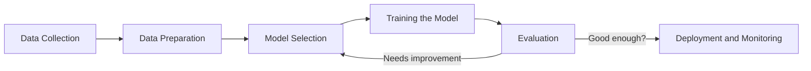

# Day 01. What is ML? Applications and key concepts

## Today's objective 

To understand what Machine Learning is, explore its main types and applications, and get familiar with the basic structure of an ML workflow.

## What is Machine Learning?
We can define Machine Learning (ML) as an subset of Artificial Intelillenge (AI). It focuses on bulding systems that learn from data to make predictions or decisions without being explicitly programmed. 

> We can think of it as teaching a computer to recognize patterns and improve its performance through experiences (data and training)

## Types of Learning 
We will learn more about it on day 2, but for todat, just get familiar with the main types:

|Type|Description|
|----------|-----------|
|Supervised|Learns from labeled data (eg. spam detection)|
|Unsupervised|Learns from patterns in unlabeled data(e.g. clustering)|
Reinforcement|Learns by interacting with an environment and receiving feedback (e.g. robotics and game AI)|

## How does ML work? 
A very simplified workflow:
1. Data Collection 
2. Data Preparation (cleaning, encoding, scaling)
3. Model Selection
4. Training the Model 
5. Evaluation 
6. Deployment and Monitoring 

## Some common ML tasks 
|Task|Examples|
|--------------|----------|
|Classification|Email spam detection, disease diagnosis|
|Regression| House price prediction, stock forecasting|
|Clusterin| Customer segmentatio, grouping similar articles|
Dimensionality Reduction| PCA (Principal Component Analysis), data visualization|
|Recommendation| Movies/Music suggestion|

## Small note 
> Machine Learning is not *magic*. It's math + data + computing. The magic is in the patterns we didn't see before, that the model heps reveal 🌱

