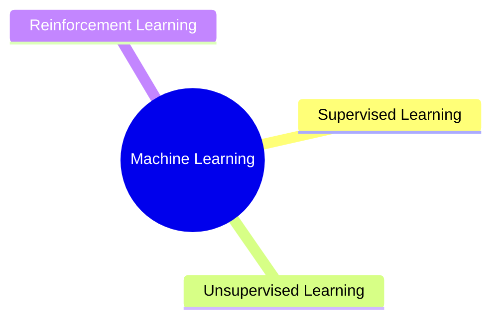

# Day 02. Types of Machine Learning: Supervised, Unsupervised, and Reinforcement Learning

## Today's objective
Understand the three main types of Machine Learning: Supervised, Unsupervised, and Reinforcement Learning by exploring their key characteristics, use cases, and examples.

## Supervised, Unsupervised, and Reinforcement Learning

Machine Learning can be broadly categorized into three main types based on the nature of the learning signal.

## Supervised Learning 

**Goal:** Learn a mapping from inputs to known outputs.

**Data:** Labeled.

**Use cases:**  Classification, regression.

**Examples:** Spam detection in emails and Predicting house prices.

**Algorithms:** Linear Regression, Logistic Regression, K-NN, Decision Trees, Random Forests, SVM, etc.

---

## Unsupervised Learning 

**Goal:** Discover hidden patterns or structure in data.

**Data:** Unlabeled.

**Use cases:**  Clustering, dimensionality reduction, anomaly detection.

**Examples:** Customer segmentation and Grouping similar news articles.

**Algorithms:** K-Means, DBSCAN, PCA, Hierarchical clustering.

---

## Reinforcement Learning
**Goal:** Learn actions through trial and error to maximize cumulative reward.

**Data:** Agents interact with an environment.

**Use cases:** Game playing, robotics, recommendation systems.

**Key concepts:** Agent, environment, reward, policy, value function.

**Examples:** AlphaGo learning to play Go. A robot learning to walk.

## Small note
>Not all problems are best solved with supervised learning. In real-world projects, a good understanding of your data and problem context helps choose the most appropriate **ML paradigm** 🌱