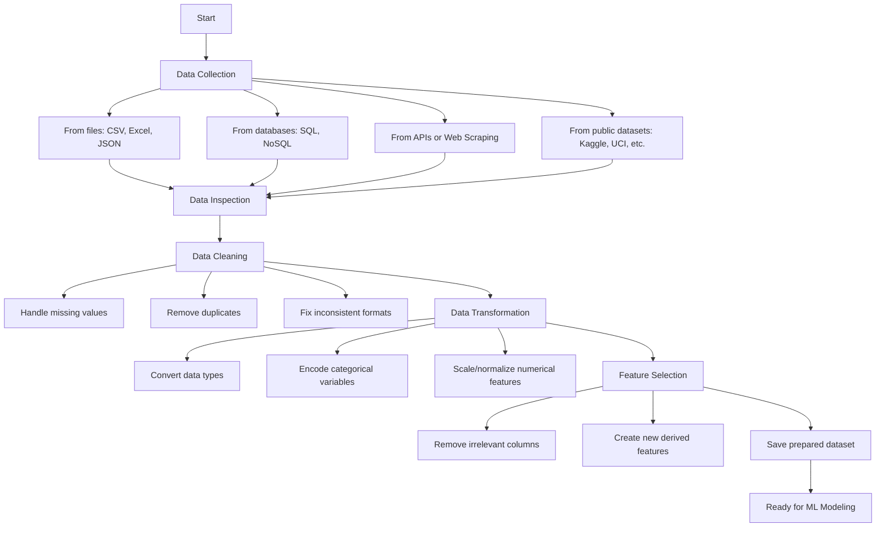

# Day 03. Data collection and preparation.
## Today's objective
Understand the process of collecting and preparing data for machine learning, ensuring it is clean, relevant, and ready for modeling.

---

## Important concepts for the process
- **Data Collection:** Gathering data from different sources such as CSV/Excel files, databases, APIs, web scraping, or public datasets.

- **Data Preparation:** Transforming raw data into a suitable format:
    - Cleaning (handling missing/duplicate values)
    - Type conversion (e.g., string to numeric)
    - Formatting (dates, categories, etc.)
    - Initial feature selection

---

## Small note 
> Data preparation often takes 80% of the total ML project time. Don’t rush it, better data means better models 🌱