# Day 07. Encoding and normalization

## Today’s Objective

Understand how to transform categorical and numerical data into formats that machine learning algorithms can effectively use, focusing on encoding categorical variables and normalizing/standardizing numerical features.

## Encoding Categorical Data

```mermaid
  mindmap
  root((Encoding & Normalization))
    Encoding
      Label Encoding
        Assign numbers to categories
        Risk of implying order
      One-Hot Encoding
        Binary columns
        Safe for nominal categories
      Ordinal Encoding
        Use when categories have order
    Normalization
      Min-Max Scaling
        Scale to 0,1
        Formula: x - min / max - min
        Good for neural networks
    Standardization
      Z-score
        Mean = 0, Std = 1
        Formula: x - μ / σ
        Good for regression, SVM
    Importance
      ML models need numbers
      Avoid bias from scale differences
      Essential preprocessing step
```

**Why? ML models need numbers, not text.**

**Techniques**
- Label Encoding: Assigns a number to each category (e.g., Male=0, Female=1).
  Risk: Models may interpret numbers as having an order.

- One-Hot Encoding: Creates binary columns for each category (e.g., [Male=1, Female=0]). Safer for non-ordinal categories.

- Ordinal Encoding: When categories have a natural order (e.g., Low < Medium < High).

## Normalization and Standardization

**Why? Features with very different scales can distort model performance.**

**Techniques**

- Min-Max Normalization (Scaling to `[0,1]`):
    $$
    x' = \dfrac{x-x_{min}}{x_{max}-x_{min}}
    $$

- Standardization (Z-score): Mean = 0, Std = 1.
    $$
    z = \dfrac{z-\mu}{\sigma}
    $$
- When to use:
    - Normalization → when you need all features in `[0,1]` (e.g., neural networks).
    - Standardization → when data distribution matters (e.g., regression, SVM).

## Small note 
> Encoding and normalization are data preprocessing essentials. Without them, many ML algorithms either fail or give biased results. Think of them as “translators” that make raw human-readable data understandable to mathematical models 🌱

