# Day 09. Linear regression
## Today's objective 
Learn the basics of Linear Regression, one of the simplest and most widely used algorithms in machine learning, used to model the relationship between variables.

## What is Linear regression?
Linear regression tries to find the best-fitting straight line that explains the relationship between an independent variable $X$ and a dependent variable $y$.

- Simple Linear Regression: One feature (1D line).
$$
y = \beta_0 + \beta_1 X + ϵ
$$

- Multiple Linear Regression: Several features (a hyperplane).

$$
y = \beta_0 + \beta_1 X_1 + \beta_2 X_2 + ... + \beta_n X_n + ϵ
$$

where 
- $\beta_0$ is the intercept
- $\beta_n$ are the coefficients (slopes)
- $\epsilon$ is the error term 

The model is usually fitted using **Ordinary Least Squares** (OLS), which minimizes the sum of squared errors.

In python you can use 
```python
from sklearn.linear_model import LinearRegression
```
## Workflow 

```mermaid 
flowchart TD

A[Dataset] --> B[Split into Train/Test]
B --> C[Train Model with Linear Regression]
C --> D[Model learns coefficients β]
D --> E[Predict on Test Data]
E --> F[Evaluate Performance: RMSE, R², Residuals]
F --> G[Visualization: Scatter + Regression Line]
```


## Small note 

> Linear regression is simple but powerful as a baseline model. It’s often the first step before trying more complex algorithms. However, it has limitations: 
>1. Assumes a linear relationship between features and target.
>2. Sensitive to outliers.
>3. Multicollinearity between features can distort coefficients 🌱